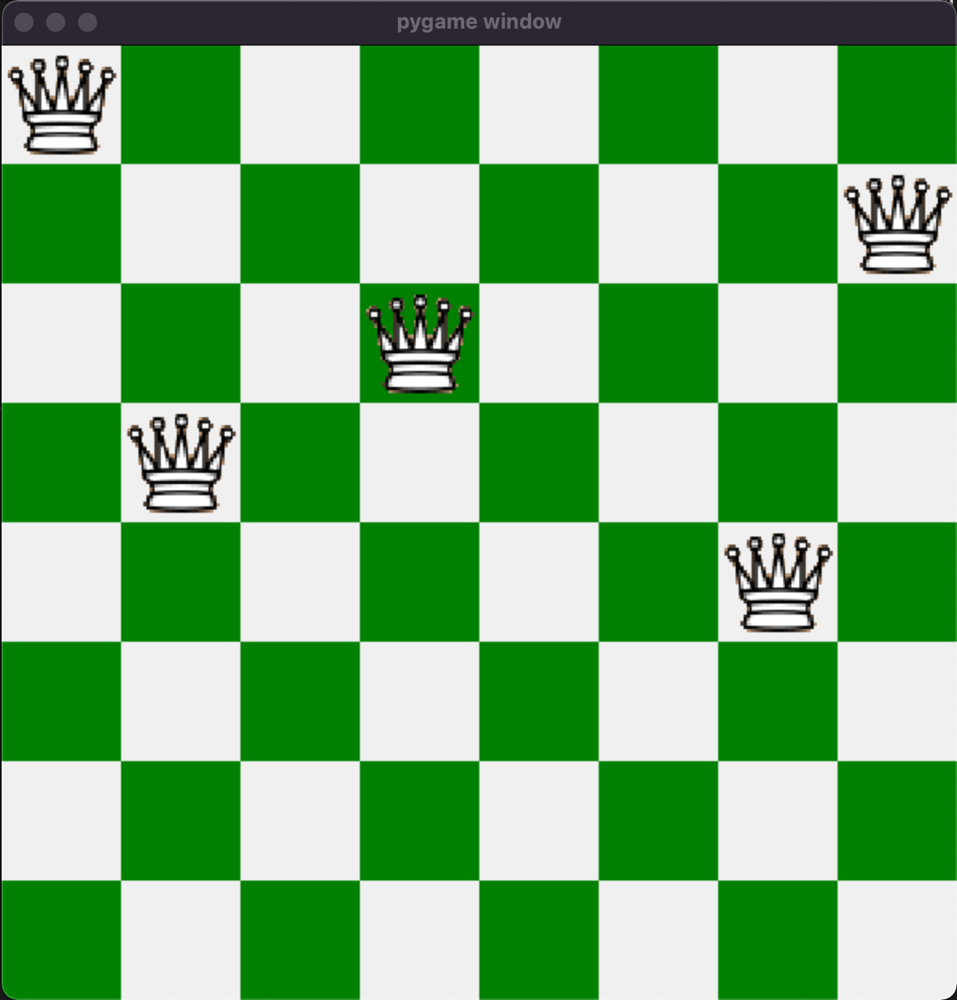

# N-QUEEN Visualizer

This is a generalised N-Queen Visualizer that uses PyGame to visualize the working of DFS and Backtracking approach for solving the problem.

---
Setup:

1. Clone or download the repo
```
git clone https://github.com/thakreyn/nqueen-visualizer.git
```
2. Install Requirements:
```
pip install -r requirements.txt
```
3. Run Main.py
```
python main.py
```
---
### Key Components:

1. Solve function in `test.py` takes in a blank board and helper arrays as input and performs backtracking on the given board to place the queens on the board.

2. Render function in `main.py` renders the pygame window and the chessboard. It then calls the `placeQueens` function.

3. placeQueens() takes the board as input and renders the queens onto the chess board. If the board is a valid solution, it waits for 2 seconds and then resumes the process.

---
### Screenshots


